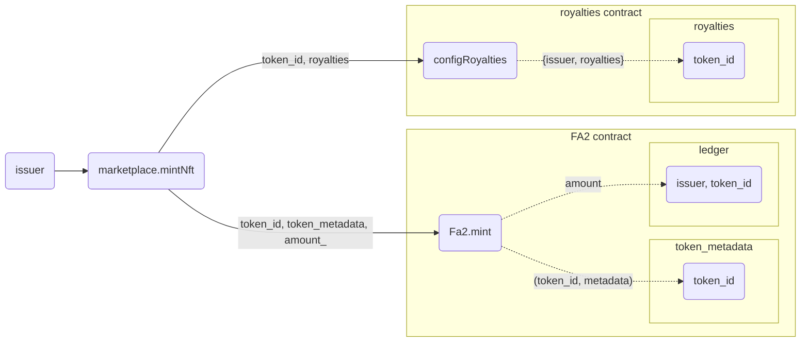
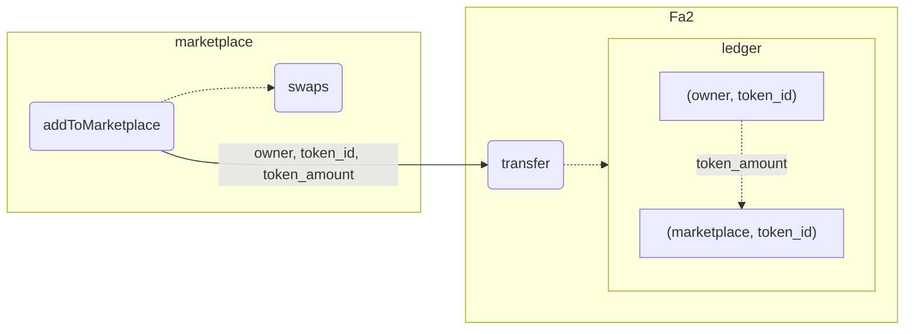
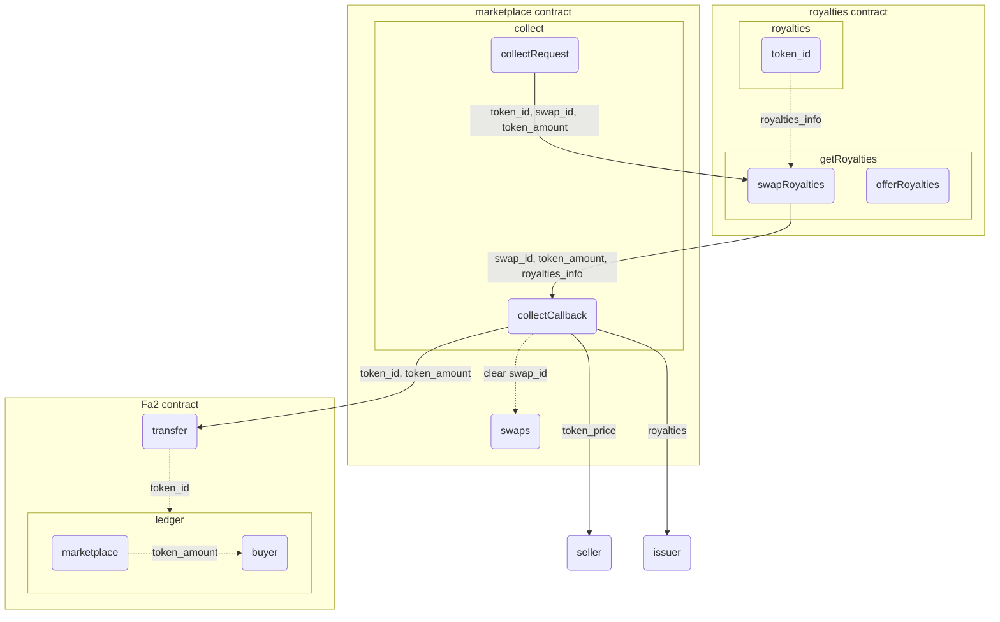
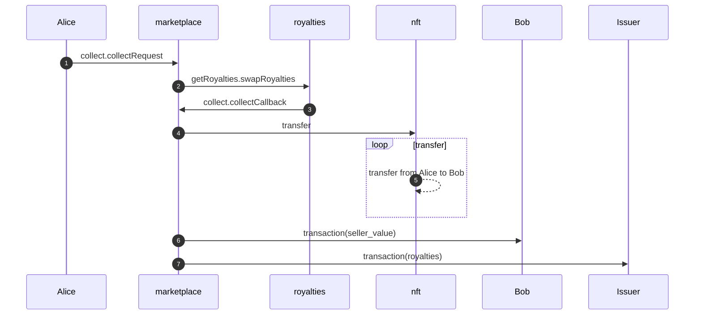
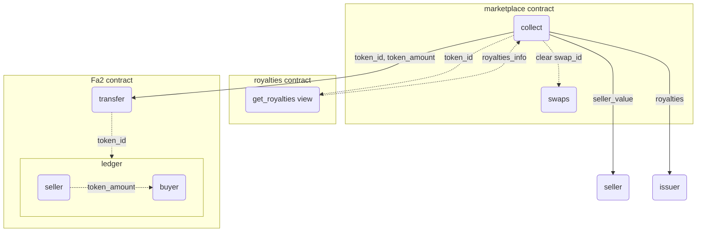
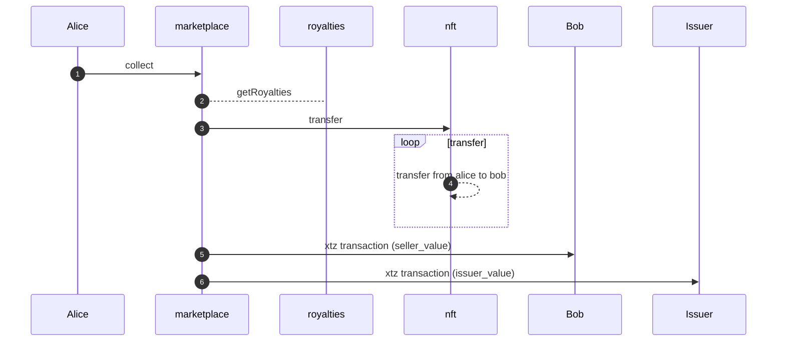
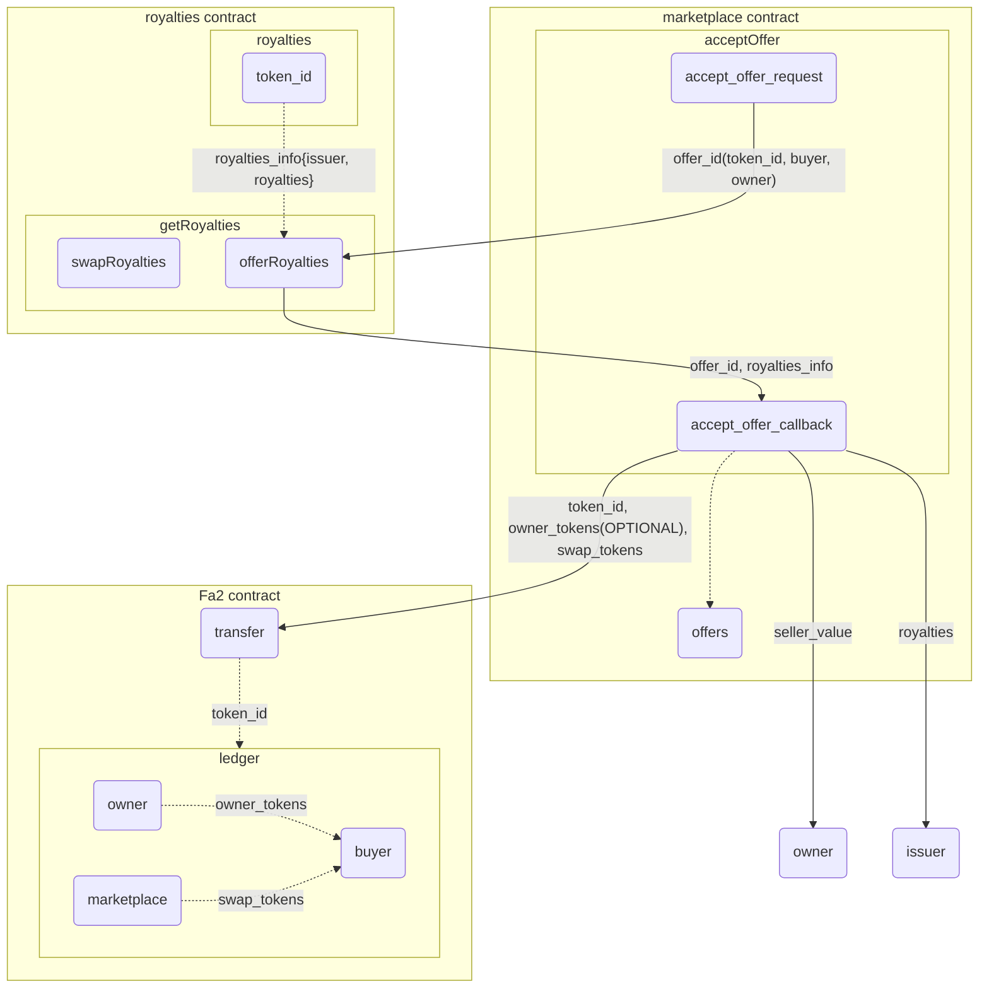
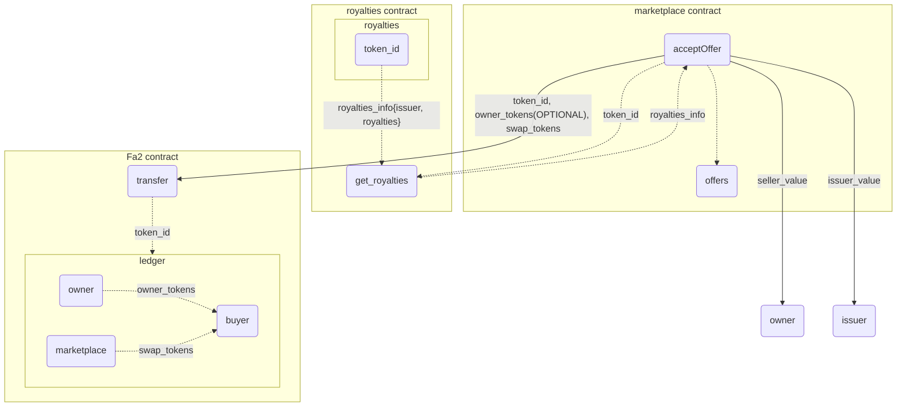

# Artos Marketplace 
This document is a description of an NFT marketplace compsed of an assortment of smart-contract.

The system has two key user-facing smart-contracts:
- **Marketplace:** A smart contract which handles *fixed-price* sales and *dutch auctions*.
  - *fixed price* sales are 
The marketplace contract handles also NFT minting and royalties assignment.
- **Auction:** A smart contract which handles auctions, both *transparent* auctions and *blind* auctions.

  - *transparent auction:* everyone can see who placed what bid. when a new highest bid is placed, the bidder who placed the former highest bidder gets automatic refund.
  - *blind auction:* all bids are consealed. refunding and winnings are handed out by the swap owner when the auction ends.

## Operations:

---

**For fixed-price swaps:**

* A token is minted by the asset owner.
* A single edition of the minted token is added to the marketplace.
* The buyer sends payment, if the corect amount is sent the buyer gets ownership of the token, and the former owner gets funds.
  
**For auction swaps:**

* A token is minted by the asset owner.
* An auction is being initialised with its different settings chosen.
* Bidders place bids at the pre-determined auction period.
* At the end of the bidding period, if a set of conditions is met, the highest bidder gets ownership of the token, and the former owner gets funds.

**Note: For all swap types, royalties and management fees are deducted from the swap owner's funds at the swap finalisation**

***For the rest of this document the titles `marketplace` and `auction` refer to two different contracts with different swap options.*** 
   
## Administration Tools:

**Administration entrypoints are identical in both `marketplace` contract and `auction` contract.**
**Entrypoints which are unique for one of the contracts will be specified with the name of the contract below the entrypoint's name, common entrypoints will be specified as `common`**

---

The contracts have one admin each, with the ability to change some key configurations with the following entrypoints:

### **updateAdmin:**

**Common**

Change the admin address. The former admin forfeits admin priveleges, as there is only one admin.  
**Input Parameter:**  
-  `address`: The new admin's address.

### **updateNftAddress:** 

**Common**

Change the NFT contract address.  
**Input parameter:**  
-  `address`: The new NFT contract address.

### **updateFee:**  

**Common**

Change the management fee. The fee applies to all swaps under the contract.  
**Input parameter:**  
- `nat`: The new management fee.  

**note: the management fee applied to swaps is specified by `management_fee_rate / 10,000`, or more simply `management_fee_rate * 0.01%`, to allow two decimals.**

## NFT Issuer Tools:
---

### **mintNft:**

**Marketplace**
 
Mint a new nft with an id corresponding to the token id in the nft contract.
- The new NFT will be listed in the `nft`'s `ledger` with `key = (sender : address, token_id : nat), value = (amount : nat)`.
- The royalties related to the minted token will be listed in the `nft`'s `royalties` with `key = (token_id : nat), value = (royalties : { issuer : address; royalties : nat})`.

**Input parameters:**   

- `metadata_url: string` : A url pointing to the token's metadata specifications
- `royalties: nat` : The royalties related to the token (in 0.01%)
- `amount_ : nat` : the number of token editions.

### **updateRoyalties:**

**Marketplace** 

Change the royalties rate for a specific token.
This entrypoint interacts with `nft`'s `updateRoyalties` entrypoints.
The new royalties information is stored in `nft`'s `royalties` with `key = (token_id : nat), value = (royalties : { issuer : address; royalties : nat})`.
The royalties can be updated only by the token's issuer as sender of the transaction.

**Input parameters:**
- `token_id : nat` 
- `royalties : nat` : The NFT's new royalties rate. 

## Seller Tools:
---

### ***IMPORTANT : before initialising a swap using `addToMarketplace` or `startAuction`, the calling contract has to be confirmed as an operator by the token owner. `nft.updateOperator` entrypoint has to be called first.***

---
### **addToMarketplace**  

**Marketplace**

This entry-point is used for initializing a fixed-price type swap.

**Input parameters:**  
- `token_id: nat` : The token which is being put on sale.
- `price_xtz: tez` : The token's price (in muTez).
- `start_time: timestamp` : The time at which the token will be put up for sale.
- `end_time: timestamp` : The time at which the token will not be on sale anymore.
- `is_onSale : bool` : Specifies if the token can get offers.

**note: currently one token edition is added to marketplace per initialisation.**

### **updatePrice**

**marketplace**

Change the price of a token on the marketplace.

**Input parameters:**

- `swap_id : nat` : The updated swap.
- `value : tez` : The new price (in mutez).
- `start_time : timestamp` : The new time for the beginning of the sale.
- `end_time : timestamp` : The new time for the end of the sale.

### **startAuction**

**Auction**

This entry-point is used for initializing an auction type swap.  
**Input arameters:**  
- `token_id : nat` : The token which is being put on auction.
- `start_time : timestamp` : The time at which the auction will start (can be the present time or some future time).
- `period : nat` : The auction's period (in seconds).
- `starting_price : tez` : The initial price of the token (in muTez).
- `is_blind : bool` : Determines if the auction will be transperant or blind.
- `reserved_price_hashed : bytes` : Sets a hidden 'reserved price': a price under which the seller can choose to accept or not accept the highest offer the hash is composed of the price and a `secret`, and is revealed at a later time with the same values.
- `reveal_time : int` : A period (in seconds) after the auction's end time at which the seller can reveal the reserved price and accept lower offers.
- `adding_period : int` : A period (30 - 300 seconds) before the auction's end time, at which if a bidder places a bid the auction period is prolonged.
- `extra_duration : int` : The duration (in seconds) that is being added to the auction period if a bid is placed at the `adding_period`.

**note: currently one token edition is put up for auction per initialisation.**

### **revealPrice:**

**Auction**

This entrypoint is used by the seller in auction swaps that a reserved-price was set for. 
The seller can reveal the price in a period after the auction ends. When the price is revealed the seller can choose if a highest bid which is lower than the reserved price will be permitted to win the auction.
**Input parameters:**
- `swap_id : nat` : The id of the swap owned by the seller.
- `revealed_price` a record of type `{ price : tez; secret : string}` : the reserved price and the secret that were set in the `start_auction` entrypoint, for comparison.
- `permit_lower : bool` : sets permission for a highest bid that's lower than the reserved price to win the auction.

### **removeFromMarketplace**

**Common**

This entrypoint is used to remove a swap from the marketplace. The NFT is not burned, just not up for sale.  
**Input parameter:**  
- `nat` : The cancled swap's id.

---

## Buyer Tools:

### **bid:**  

**Auction**

This entrypoint is used by bidders for 'transparent' auctions. When a new highest bid is placed, the former highest bidder is refunded automatically.
**Input parameter:**
- `swap_id : nat`  

**this entrepoint has to be called with an amount transfered**  

### **blindBid:**

**Auction**

This entrypoint handles bids for a blind auction.
The bidder sends an amount, along with the swap's id and a hash which is an incripted `(value, fake, secret)` tuple.  
Here `value` is some value in tez, either the correct `amount` that was sent, or some fake value.   
If `value` is fake, then `fake` is set to `true`, or else the bid will be invalid at the revealation proccess and the corresponding `amount` will be kept by the contract.  
`secret` is some secret of type `string`, which is used for the revealation proccess.  
**Input parameters:**
- `(swap_id, hash) : nat * bytes`  

**this entrepoint has to be called with an amount transfered** 

### **revealBids:**

**Auction**

This entrypoint is used by the bidder after the auction's `end_time` to reveal the blind bids placed by them.  
The values sent are compared by the contract to the hash sent at the bidding period, and are determined as valid or invalid.   
Invalid values sent will be penalized by the marketplace keeping the amount that was attached to those values, valid values will either (the highest not fake amount) be listed as `pending_returns` : bids that are later compared to other bidders `pending_returns` and determine the auction's winner, or returned (fake amounts or lower bids).
**Input parameters:**
- `swap_id : nat`
- `revealed_bids : reveald_bids list` at which:
-  - `amount_ : tez` : The amount that was transferred at the `blindBid` entrypoint call corresponding with the values.
-  - `value : tez` : The same value that was sent as part of the hash sent at the `blindBid` entrypoint call.
-  - `fake : bool` : The same fake `true/false` that was sent as part of the hash sent at the `blindBid` entrypoint call.
-  - `secret : string` : The same `secret` that was sent as part of the hash sent at the `blindBid` entrypoint call.

The contract then hashes a tuple `(value, fake, secret)`, and compares the resault with the bis's hash.

**comparison outcome:**

- If the list of hashed parameters doesn't fit the list of hashes from the bidding stage, the contract fails and amounts are kept by the contract.
- If a bid's `fake` is `false`, and the `amount_` is not equal to the `value`, the bid is determined as invalid and `amount_` is kept by the contract as a penalty.
- If a bid's `fake` is `true` and the `amount_` is greater than `value`, the bid is valid and fake, and is refunded.
- If a bid's `fake` is `false` and the `amount_` is the highest of all `amount_`s sent by the bidder, the bid is listed in `pending_returns` and competes for winning the auction.
- All other combinations are refunded.  

### **send_offer**
**Marketplace**
This entrypoint is used by a buyer to make an offer (in tez), available only between `start_time` and `end_time`.
By making an offer, the buyer send his offfer value to the smart contract `marketplace`.
For each swap, a buyer can at most make one offer. To update his offer, he has to cancel his current offer and start by a new offer. 
**Input parameters:**
- `swap_id : nat`
- `start_time : timestamp` : The offer time period start.
- `end_time : timestamp` : The offer time period end.

### **withdraw_offer**

**marketplace**

This entrypoint is used by a buyer to cancel his offer for a swap. Then, the buyer recieves from the smart contract `marketplace` his offer value (intez).

**Input parameters:**

- `swap_id : nat` : the id of the swap.

### **accept_offer**

**marketplace**

This entrypoint is used by the seller to accept an offer for his swap. If the seller calls this entrypoint within the time limit of the offer, 
then the entrypoint collect is called. Hence, the issuer of the NFT recieves his royality, the plateform the fees and the seller the rest.

**Input parameters:**

- `swap_id : nat` : the swap corresponding to the offer accepted.
- `offer : address` : The offer sender's address.

---

## Collecting tools:

### **collect:**

**Common**

This entrypoint is called by the winning bidder of transparent auctions to make the `token <-> funds` exchange.  
NFT is transferred to the winning bidder, and funds are transferred to the former NFT owner, deducting a management fee payed to the contract's owner, and royalties payed to the NFT's issuer.

**Input parameter:** 
- `swap_id : nat`  
- `royalties_info : {issuer : address; royalties : nat}` : can be dummy information, as this is used for getting the real royalties info from `nft`'s `getRoyalties` callback entrypoint.
- `amount_ : tez` : For `marketplace` - the actual swap amount (price). For `auction` - can be dummy information as the `collect` entrypoint gathers this information from storage.

# {* TODO - operation description *}

This entrypoint is called by the seller of the NFT to finalise a blind auction.  
The list of `pending_returns` are being compared, and a winner is determined.  
NFT is transferred to the winning bidder, and funds are transferred to the former NFT owner, deducting a management fee payed to the contract's owner, and royalties payed to the NFT's issuer.

---
## Cross-Contract Interactions:

The marketplace contract interacts with a single `FA2` NFT contract.
Interactions are made at a few different stages of operation:

**minting:**

The NFT contract's `mint` entrypoint is called by the marketplace at the token minting proccess, using the `mintNft` entrypoint.
The parameters sent to the NFT contract are:
- `token_id` : the minted NFT's id, assigned iteratively by the marketplace.
- `metadata_url` : a url pointing to the token's metadata.
The NFT contract assigns the marketplace `mintNft` entrypoint's caller's address to the `token_id`, and adds that assignment to the `ledger`.
The NFT contract assigns the same `token_id` the `metadata_url`, and adds that assignment to the `token_metadata` map.
- `amount_` : the number of editions the token will have.

**swap initialisation:**

The NFT's contract's `transfer` entrypoint is called by the marketplace at all swap starts.
This is being done by one of these entrypoints, depending on the swap's type:
- `addToMarketplace` (fixed price)
- `startAuction` (aution)
  
The chosen token's id and the marketplace's address are being reassigned the amount of editions transfered (currently one), and updates that entry at the `ledger`, which maps `(owner, token_id) -> amount_`.

**swap finalisation:**
The NFT's contract's `transfer` entrypoint is called by the marketplace at all swap ends.
This is being done by one of these entrypoints, depending on the swap's type:
- `collect` - winner's address is the address calling the entrypoint.

The chosen winner's address and token's id are being reassigned the amount of editions bought (currently one), and updates that entry at the `ledger`, which maps `(owner, token_id) -> amount_`.

---

## **Operation Schematics:**

**notes:**
- for all following graphs, solid lines represent cross-contract operations and dotted lines represent actions not involving cross-contract operations.
- minting and accepting-offers are operations specific to the `marketplace` contract. Swap initialization and finalization are common to all user-facing contracts (currently `marketplace`, `auction` and `blind auction`)

### **Minting proccess:**

<!--  -->

### **Swap Initialisation:**

### **Swap Finalization:**

#### **With Callbacks:**

#### **With Hangzhou Views:**

    
### **Accepting Offers:**

#### **With Callbacks:**

#### **with views:**

